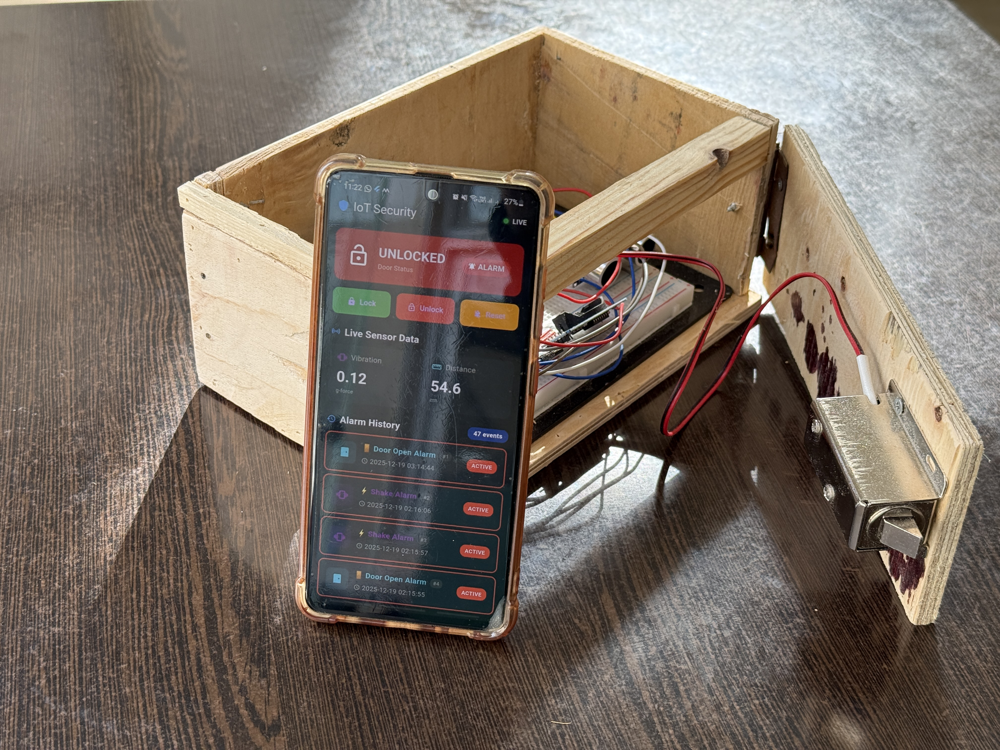
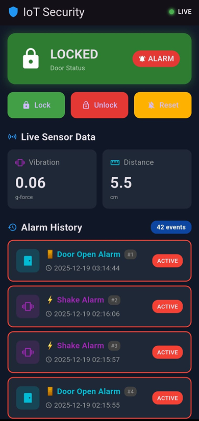

# SmartGuard -- IoT Smart Security System

SmartGuard is an IoT-based smart security system that detects
unauthorized access attempts and allows real-time monitoring and control
through a mobile application.

The system integrates embedded hardware, cloud services, and a mobile
interface to create a complete end-to-end security solution.
## Prototype

## Prototype Mobile Application Interface

------------------------------------------------------------------------

## System Overview

The system consists of three main layers:

1.  Embedded Hardware Layer
2.  Cloud Backend
3.  Mobile Application

Sensors detect physical intrusion events, the ESP32 processes the data,
and the system synchronizes with a cloud database that communicates with
the mobile application in real time.

------------------------------------------------------------------------

## Hardware Components

-   ESP32 microcontroller (system controller)
-   MPU6050 accelerometer / vibration sensor
-   Ultrasonic distance sensor
-   DS3231 Real Time Clock
-   OLED display
-   Relay module
-   Solenoid door lock
-   Buzzer alarm
-   LED status indicators

------------------------------------------------------------------------

## System Features

• Intrusion detection using vibration and distance sensors\
• Real-time mobile monitoring and control\
• Remote door lock / unlock functionality\
• Alarm triggering with buzzer and LED indicators\
• Timestamped event logging using RTC\
• Cloud synchronization via Firebase\
• Mobile application interface for status monitoring and alerts
• Remote door lock / unlock through mobile application

------------------------------------------------------------------------

## System Architecture

Sensors → ESP32 Firmware → Firebase Realtime Database → Mobile
Application → User Control

------------------------------------------------------------------------

## Mobile Application

The Flutter mobile application allows users to:

-   Monitor system status
-   View live sensor data
-   Lock or unlock the door remotely
-   Receive alarm notifications
-   View alarm history logs with timestamps

------------------------------------------------------------------------

## Repository Structure

SmartGuard-IoT-Security-System

├── firmware\
│ └── esp32_security_system.ino

├── docs\
│ ├── Smart Security System Technical Report.pdf\
│ └── SmartGuard Presentation.pdf

├── images\
│ ├── prototype-1.jpg\
│ ├── prototype-2.jpg\
│ ├── prototype-3.jpg\
│ └── prototype-4.jpg

------------------------------------------------------------------------

## My Role

Hardware & Embedded Systems

• Designed and wired the full electronic circuit\
• Developed the ESP32 firmware and system logic\
• Implemented intrusion detection algorithms\
• Implemented relay-controlled solenoid lock mechanism\
• Integrated OLED display and RTC timestamp logging\
• Performed hardware debugging, testing, and system validation

------------------------------------------------------------------------

## Applications

-   Home security systems
-   Office and laboratory protection
-   Smart lockers
-   Restricted access systems
-   IoT-based monitoring platforms

------------------------------------------------------------------------

## Technologies Used

-   C++ (ESP32 firmware)
-   Arduino framework
-   Firebase Realtime Database
-   Flutter mobile development
-   Embedded systems design
-   IoT networking

------------------------------------------------------------------------

## Author

Mahmoud Hany\
Computer Engineering Student -- Arab Academy for Science, Technology &
Maritime Transport
